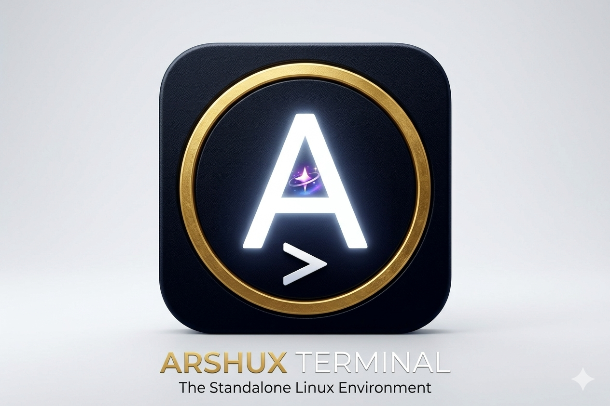

# ⚡ ArshUX Terminal

ArshUX Terminal is a dependency-free, offline-first portfolio terminal with a neon terminal aesthetic. It is a static Progressive Web App: no build step, server, framework runtime, or account is required.



## Features

- Persistent virtual filesystem backed by IndexedDB
- Multiple terminal sessions, command history, keyboard shortcuts, and mobile special keys
- Filesystem commands, aliases, tab completion, suggestions, and useful validation errors
- Portfolio commands powered by one centralized configuration object
- Seven optional themes: Matrix, Cyberpunk, Dracula, Ubuntu, Hacker, Windows 95, and Nord
- Offline app shell, installable manifest, Android/desktop icons, and a service worker
- Mobile-first terminal layout with safe-area support and a scrollable terminal viewport

## Commands

| Group | Commands |
| --- | --- |
| Filesystem | `ls`, `cd`, `pwd`, `mkdir`, `touch`, `cat`, `write`, `rm -r`, `tree` |
| Terminal | `help`, `clear`, `alias`, `theme`, `Tab`, `↑`, `↓`, `Ctrl+L`, `Esc`, `Ctrl+C` |
| Portfolio | `about`, `skills`, `projects`, `contact`, `resume`, `socials`, `whoami` |
| Fun | `coffee`, `fortune`, `matrix`, `hack nasa`, `sudo make me a sandwich` |

Examples:

```text
mkdir notes
cd notes
write ideas.txt "Ship the useful thing first"
cat ideas.txt
theme dracula
alias ll=ls
```

## Architecture

```text
index.html     Responsive application shell and styles
app.js         Terminal controller, command router, virtual filesystem, storage, themes
manifest.json  Install metadata, scope, colors, and icons
sw.js          App-shell precache and offline navigation fallback
icons/         PNG install icons (including 192px and 512px)
```

The `PORTFOLIO` object in `app.js` is the single source of truth for portfolio command content. `VirtualFileSystem` owns path normalization and filesystem operations, while `Storage` persists the filesystem, aliases, and selected theme in IndexedDB.

## Installation and development

Serve the repository over HTTPS or `localhost`; service workers cannot run from `file://` URLs.

```bash
python3 -m http.server 8080
```

Open `http://localhost:8080` and use your browser's **Install app** action. On Android Chrome, use **Install app** from the menu. On Chrome or Edge desktop, use the install icon in the address bar. Once the service worker has installed, the local terminal app shell and icons are available offline.

## PWA support

- `manifest.json` uses relative URLs, so it works at the origin root and GitHub Pages-style subpaths.
- The service worker precaches the application shell, manifest, and every bundled icon.
- The 192px and 512px PNG icons satisfy Android and desktop install requirements.
- The optional external network is not required for core terminal functionality; filesystem data is local to the browser.

## Accessibility and responsive behavior

The terminal has labelled controls, visible keyboard focus, reduced-motion handling, mobile-friendly input sizing, safe-area padding, and horizontally scrollable tab/special-key strips. The output pane is the only vertical scroll region, which prevents the command input from being pushed off-screen by long output or a mobile keyboard.

## Roadmap

- Add close/rename controls for terminal sessions.
- Add import/export for the virtual filesystem.
- Add automated browser and PWA audit coverage when a browser runtime is available in CI.

## License

MIT. See [LICENSE](LICENSE).
